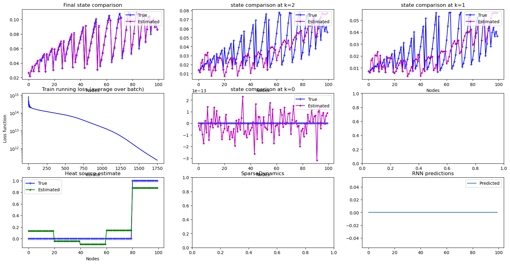
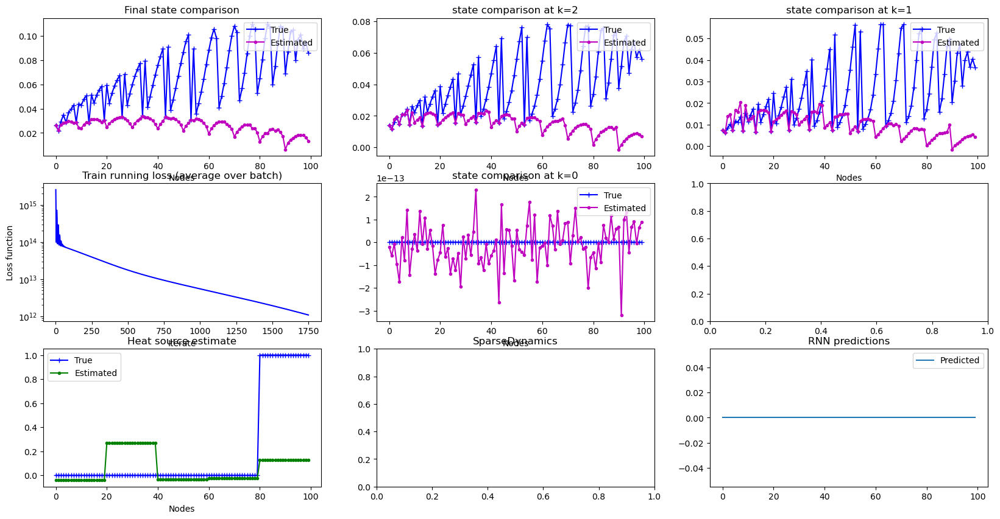

# Hidden-Heat-Sources-Estimation-In-Real-Time-With-A-Deep-Kalman-Filter

This is a description of the experiments and the companion software repo for the article

Marco Dell'Orto and Fabio Marcuzzi, "Hidden Heat-Sources Estimation In Real-Time
With A Deep Kalman Filter"

Let us refer to Sec. 4.1 of the article: let us consider the vector $\hat{\cal F}$ of inputs to the VarMiON model in sec. 2.2 and associate each component of this vector to a parameter within the vector $p$ of parameters in the predictor model of the DKF, see Figure 2.

These parameters are constant, therefore we are estimating a time-average value of the heat source at each discretization point.

in our experiments, the 2-D domain has been divided in 5 slices, each with its own constant heat-source term. The bottom-left plot below shows the true values of the heat-source in each slice (blue line). For convenience, nodes are numerated sequentially across the slices. In the same plot, the green line repsentes the estimate made by the DKF when a $p$ parameter is associated to each slice.

This results is due to the possibility to measure the final temperature field with a bigger extent than the measurement points used during the process evolution. This is clear by comparison with the following Figure, where the parameter $\lambda_N$ in the DKF loss-function, which controls the weight of the final temperature field prediction error, is set to zero (in the previous Figure it was very high):

